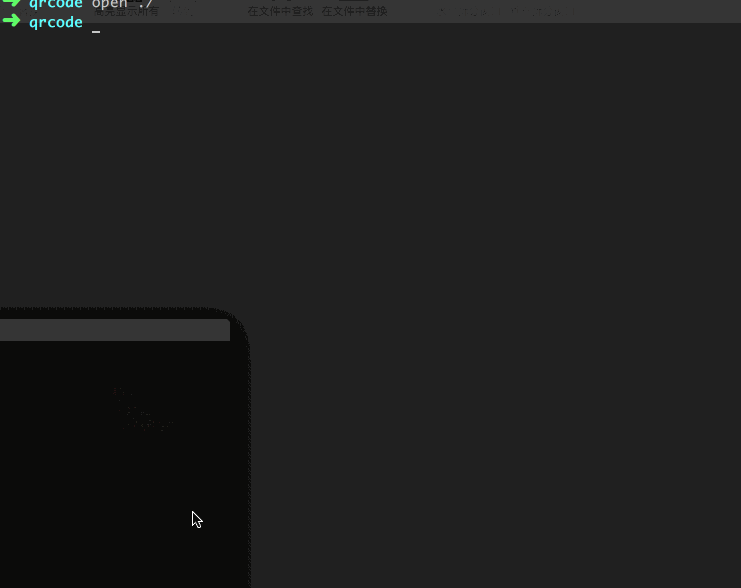

# qrcodeurl
qrcode2url and url2qrcode by python



### 1.add this dir to $PATH

### 2.need install libs:
```shell
pip install qrcode
  
```
```shell
pip install zxing
  
```
```shell
pip install hashlib
  
```


### 3.url 2 qrcode
```shell
url2qrcode.py https://www.126.com
  
```

### 4.qrcode 2 str
```shell
qrcode2url.py picname.png
  
```